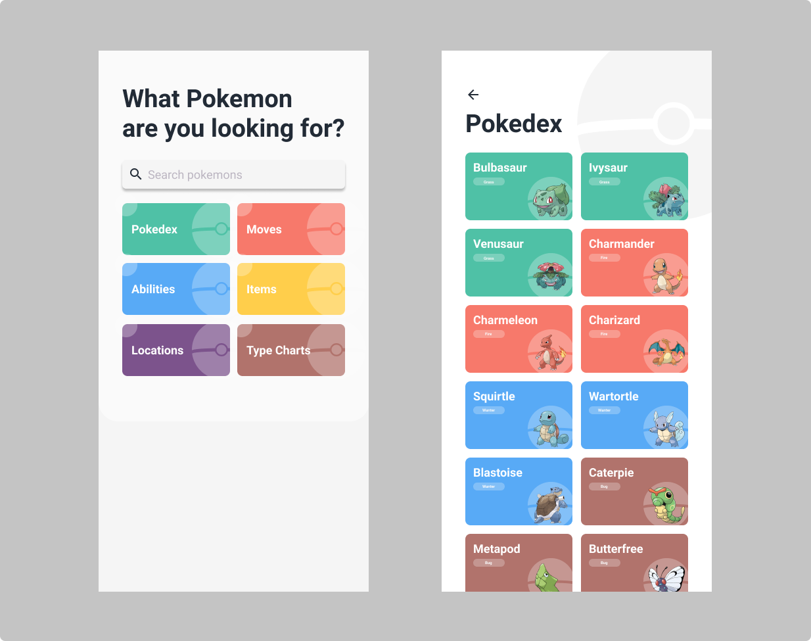

# Pokedex

## Design:

## Objetivos:
- Exibir pokemons da [api](https://pokeapi.co/)
- Realizar testes de views
- Seguir o design

## Bibliotecas:
- [Material Design](https://material.io/develop/android/)
- [Coroutines](https://developer.android.com/kotlin/coroutines?gclid=EAIaIQobChMIsOK0lMPd8QIVgYCRCh2mqwx6EAAYASAAEgIvB_D_BwE&gclsrc=aw.ds)
- [Retrofit](https://square.github.io/retrofit/)
- [Espresso](https://developer.android.com/training/testing/espresso)
- [Roboeletric](http://robolectric.org/)
- [MockK](https://mockk.io/)

